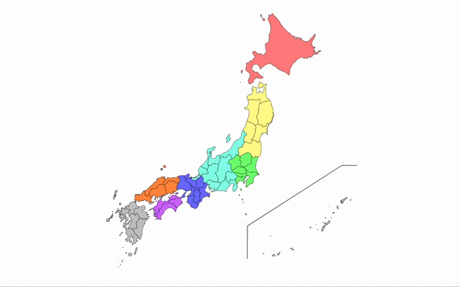

# JapanMap

[ENGLISH](README.md) | 日本語

ここでは、日本のインタラクティブな地図をレンダリングするための React コンポーネントについて説明しています。都道府県の色、ホバーエフェクト、ツールチップをカスタマイズできます。



## 機能

- すべての都道府県を含む日本の地図を表示します。
- 日本語と英語の都道府県名をサポートしています。
- 各都道府県の色をカスタマイズできます。
- 都道府県にホバーすると、カスタム説明を含むツールチップを表示します。
- JSON からの動的データ読み込みをサポートしています。

## インストール

npm を使用してライブラリをインストールします:

```bash
npm install japanmap
```

または...

<details>
<summary><strong>pnpm</strong></summary>

```bash
pnpm add japanmap
```

</details>

<details>
<summary><strong>yarn</strong></summary>

```bash
yarn add japanmap
```

</details>

<details>
<summary><strong>bun</strong></summary>

```bash
bun add japanmap
```

</details>

## 使用方法

JapanMap コンポーネントをインポートし、React アプリケーションで使用します:

```tsx
import React from 'react';
import JapanMap from 'japanmap';

const App = () => {
  return (
    <div>
      <h1>インタラクティブ日本地図</h1>
      <JapanMap
        lang="en"
        strokeColor="#000"
        strokeWidth="0.5"
        hoverColor="#E0E0E0"
        bgColor="#f0f0f0"
        size="600px"
      />
    </div>
  );
};

export default App;
```

## 都道府県データの拡張（説明と塗りつぶし色）

独自の JSON ファイルを使用して、自分の説明と塗りつぶし色を追加することで、デフォルトの都道府県データを拡張できます。

```tsx
import React from 'react';
import JapanMap from 'japanmap';
import prefecturesData from './your/path/prefecturesdata.json';

const App = () => {
  return (
    <div>
      <h1>インタラクティブ日本地図</h1>
      <JapanMap
        data={prefecturesData}
        lang="en"
        strokeColor="#000"
        strokeWidth="0.5"
        hoverColor="#E0E0E0"
        bgColor="#f0f0f0"
        size="600px"
      />
    </div>
  );
};

export default App;
```

## プロパティ

JapanMap コンポーネントは、次のプロパティを受け入れます（すべてオプションです）：

| Property      | Type                                                       | Description                                                          |
| ------------- | ---------------------------------------------------------- | -------------------------------------------------------------------- |
| `data`        | `Array<{ id: string; description: string; fill: string }>` | Data for the prefectures, including ID, description, and fill color. |
| `strokeColor` | `string`                                                   | Color of the prefecture borders.                                     |
| `strokeWidth` | `string`                                                   | Width of the prefecture borders.                                     |
| `hoverColor`  | `string`                                                   | Fill color when hovering over a prefecture.                          |
| `bgColor`     | `string`                                                   | Background color of the map.                                         |
| `size`        | `string`                                                   | Width of the map component.                                          |

## 都道府県データ形式

data プロパティは、次の構造を持つオブジェクトの配列を期待します：

```json
[
  {
    "id": "JP01",
    "description": "北海道は日本最北の都道府県です。",
    "fill": "#88C0D0"
  },
  {
    "id": "JP02",
    "description": "青森県はりんごの生産で知られています。",
    "fill": "#BF616A"
  },
  ...
]
```

- id: 各都道府県の一意の識別子。ISO 3166-2
  標準を使用しています。（JP01...JP47）
- description: 都道府県にホバーしたときにツールチップに表示される文字列。
- fill: 各都道府県のデフォルトの塗りつぶし色。

# 都道府県コード

以下の表から各都道府県に対応する ID を選択してください。これらの ID は JSON ファイルにエントリを追加するために使用され、インタラクティブな地図で各都道府県のラベル付けや色の変更を識別するのに役立ちます。

<table>
    <thead>
        <tr>
            <th>ID</th>
            <th>都道府県</th>
            <th>ISO 3166-2:JP</th>
        </tr>
    </thead>
    <tbody>
        <tr style="color: #FF5733;">
            <td>JP01</td>
            <td>Hokkaido</td>
            <td>JP-01</td>
        </tr>
        <tr style="color: #FF8D33;">
            <td>JP02</td>
            <td>Aomori</td>
            <td>JP-02</td>
        </tr>
        <tr style="color: #FFBD33;">
            <td>JP03</td>
            <td>Iwate</td>
            <td>JP-03</td>
        </tr>
        <tr style="color: #FFFF33;">
            <td>JP04</td>
            <td>Miyagi</td>
            <td>JP-04</td>
        </tr>
        <tr style="color: #BFFF33;">
            <td>JP05</td>
            <td>Akita</td>
            <td>JP-05</td>
        </tr>
        <tr style="color: #7FFF33;">
            <td>JP06</td>
            <td>Yamagata</td>
            <td>JP-06</td>
        </tr>
        <tr style="color: #33FF57;">
            <td>JP07</td>
            <td>Fukushima</td>
            <td>JP-07</td>
        </tr>
        <tr style="color: #33FFBD;">
            <td>JP08</td>
            <td>Ibaraki</td>
            <td>JP-08</td>
        </tr>
        <tr style="color: #33BFFF;">
            <td>JP09</td>
            <td>Tochigi</td>
            <td>JP-09</td>
        </tr>
        <tr style="color: #337FFF;">
            <td>JP10</td>
            <td>Gunma</td>
            <td>JP-10</td>
        </tr>
        <tr style="color: #3357FF;">
            <td>JP11</td>
            <td>Saitama</td>
            <td>JP-11</td>
        </tr>
        <tr style="color: #5733FF;">
            <td>JP12</td>
            <td>Chiba</td>
            <td>JP-12</td>
        </tr>
        <tr style="color: #A233FF;">
            <td>JP13</td>
            <td>Tokyo</td>
            <td>JP-13</td>
        </tr>
        <tr style="color: #FF33A2;">
            <td>JP14</td>
            <td>Kanagawa</td>
            <td>JP-14</td>
        </tr>
        <tr style="color: #FF337F;">
            <td>JP15</td>
            <td>Niigata</td>
            <td>JP-15</td>
        </tr>
        <tr style="color: #FF3357;">
            <td>JP16</td>
            <td>Toyama</td>
            <td>JP-16</td>
        </tr>
        <tr style="color: #FF5733;">
            <td>JP17</td>
            <td>Ishikawa</td>
            <td>JP-17</td>
        </tr>
        <tr style="color: #FF8D33;">
            <td>JP18</td>
            <td>Fukui</td>
            <td>JP-18</td>
        </tr>
        <tr style="color: #FFBD33;">
            <td>JP19</td>
            <td>Yamanashi</td>
            <td>JP-19</td>
        </tr>
        <tr style="color: #FFFF33;">
            <td>JP20</td>
            <td>Nagano</td>
            <td>JP-20</td>
        </tr>
        <tr style="color: #BFFF33;">
            <td>JP21</td>
            <td>Gifu</td>
            <td>JP-21</td>
        </tr>
        <tr style="color: #7FFF33;">
            <td>JP22</td>
            <td>Shizuoka</td>
            <td>JP-22</td>
        </tr>
        <tr style="color: #33FF57;">
            <td>JP23</td>
            <td>Aichi</td>
            <td>JP-23</td>
        </tr>
        <tr style="color: #33FFBD;">
            <td>JP24</td>
            <td>Mie</td>
            <td>JP-24</td>
        </tr>
        <tr style="color: #33BFFF;">
            <td>JP25</td>
            <td>Shiga</td>
            <td>JP-25</td>
        </tr>
        <tr style="color: #337FFF;">
            <td>JP26</td>
            <td>Kyoto</td>
            <td>JP-26</td>
        </tr>
        <tr style="color: #3357FF;">
            <td>JP27</td>
            <td>Osaka</td>
            <td>JP-27</td>
        </tr>
        <tr style="color: #5733FF;">
            <td>JP28</td>
            <td>Hyogo</td>
            <td>JP-28</td>
        </tr>
        <tr style="color: #A233FF;">
            <td>JP29</td>
            <td>Nara</td>
            <td>JP-29</td>
        </tr>
        <tr style="color: #FF33A2;">
            <td>JP30</td>
            <td>Wakayama</td>
            <td>JP-30</td>
        </tr>
        <tr style="color: #FF337F;">
            <td>JP31</td>
            <td>Tottori</td>
            <td>JP-31</td>
        </tr>
        <tr style="color: #FF3357;">
            <td>JP32</td>
            <td>Shimane</td>
            <td>JP-32</td>
        </tr>
        <tr style="color: #FF5733;">
            <td>JP33</td>
            <td>Okayama</td>
            <td>JP-33</td>
        </tr>
        <tr style="color: #FF8D33;">
            <td>JP34</td>
            <td>Hiroshima</td>
            <td>JP-34</td>
        </tr>
        <tr style="color: #FFBD33;">
            <td>JP35</td>
            <td>Yamaguchi</td>
            <td>JP-35</td>
        </tr>
        <tr style="color: #FFFF33;">
            <td>JP36</td>
            <td>Tokushima</td>
            <td>JP-36</td>
        </tr>
        <tr style="color: #BFFF33;">
            <td>JP37</td>
            <td>Kagawa</td>
            <td>JP-37</td>
        </tr>
        <tr style="color: #7FFF33;">
            <td>JP38</td>
            <td>Ehime</td>
            <td>JP-38</td>
        </tr>
        <tr style="color: #33FF57;">
            <td>JP39</td>
            <td>Kochi</td>
            <td>JP-39</td>
        </tr>
        <tr style="color: #33FFBD;">
            <td>JP40</td>
            <td>Fukuoka</td>
            <td>JP-40</td>
        </tr>
        <tr style="color: #33BFFF;">
            <td>JP41</td>
            <td>Saga</td>
            <td>JP-41</td>
        </tr>
        <tr style="color: #337FFF;">
            <td>JP42</td>
            <td>Nagasaki</td>
            <td>JP-42</td>
        </tr>
        <tr style="color: #3357FF;">
            <td>JP43</td>
            <td>Kumamoto</td>
            <td>JP-43</td>
        </tr>
        <tr style="color: #5733FF;">
            <td>JP44</td>
            <td>Oita</td>
            <td>JP-44</td>
        </tr>
        <tr style="color: #A233FF;">
            <td>JP45</td>
            <td>Miyazaki</td>
            <td>JP-45</td>
        </tr>
        <tr style="color: #FF33A2;">
            <td>JP46</td>
            <td>Kagoshima</td>
            <td>JP-46</td>
        </tr>
        <tr style="color: #FF337F;">
            <td>JP47</td>
            <td>Okinawa</td>
            <td>JP-47</td>
        </tr>
    </tbody>

</table>

## 開発

プロジェクトをローカルでビルドして実行するには：

1. リポジトリをクローンします：

```bash
git clone https://github.com/daikiejp/japanmap.git
cd japanmap
```

2. 依存関係をインストールします：

```bash
npm install
```

3. 開発サーバーを起動します：

```bash
npm run dev
```

## コントリビューション

貢献を歓迎します！以下の手順に従ってください：

1. リポジトリをフォークします。
2. 新しいブランチを作成します（git checkout -b feature/your-feature）。
3. 変更をコミットします（git commit -m 'Add a new feature'）。
4. ブランチにプッシュします（git push origin feature/your-feature）。
5. プルリクエストを作成します

## 著者

👤 **Danny Davila**

- ウェブサイト: [https://daikie.jp](daikie.jp)
- X (旧 Twitter): [@daikiejp](https://twitter.com/daikiejp)
- Github: [@daikiejp](https://github.com/daikiejp)

## クレジット

地図データは[Simple Maps](https://simplemaps.com/resources/svg-license)から取得しました。

## ライセンス

このプロジェクトは MIT ライセンスの下でライセンスされています - 詳細は LICENSE ファイルを参照してください。
